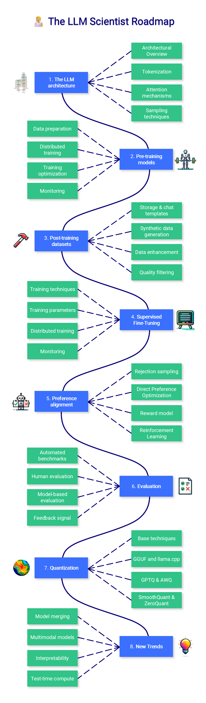

# LLM Scientist Roadmap

## 学习路线图

*图片来源：LLM Scientist Roadmap*

## 学习大纲

### 1. The LLM Architecture

- 1.1 Architectural Overview
- 1.2 Tokenization
- 1.3 Attention mechanisms
- 1.4 Sampling techniques

### 2. Pre-training models

- 2.1 Data preparation
- 2.2 Distributed training
- 2.3 Training optimization
- 2.4 Monitoring

### 3. Post-training datasets

- 3.1 Storage & chat templates
- 3.2 Synthetic data generation
- 3.3 Data enhancement
- 3.4 Quality filtering

### 4. Supervised Fine-Tuning

- 4.1 Training techniques
- 4.2 Training parameters
- 4.3 Distributed training
- 4.4 Monitoring

### 5. Preference alignment

- 5.1 Rejection sampling
- 5.2 Direct Preference Optimization
- 5.3 Reward model
- 5.4 Reinforcement Learning

### 6. Evaluation

- 6.1 Automated benchmarks
- 6.2 Human evaluation
- 6.3 Model-based evaluation
- 6.4 Feedback signal

### 7. Quantization

- 7.1 Base techniques
- 7.2 GGUF and llama.cpp
- 7.3 GPTQ & AWQ
- 7.4 SmoothQuant & ZeroQuant

### 8. New Trends

- 8.1 Model merging
- 8.2 Multimodal models
- 8.3 Interpretability
- 8.4 Test-time compute

---

## 基础理解

### Transformer结构、Attention机制，及其在大模型中的关键作用

语言模型的预训练目标：MLM、CLM
训练规模定律与模型、数据、算力协同关系

### 数据体系与数据增强

构建与处理：文本清洗、去重、指令合成、Chat模板（如ChatML/Alpaca/ShareGPT）
增强方法：Chain-of-Thought、Branch-Solve-Merge、多答案采样、personas
质量控制：MinHash/embedding去重、n-gram去污染、Reward/Judge模型过滤

### 微调与偏好对齐

SFT技术：全量微调与LoRA/QLoRA等高效微调
Preference Alignment：DPO（无需reward model，pairwise loss与on-policy采样）、PPO/GRPO（RLHF，需奖励模型，适合复杂推理）、rejection sampling技巧
Reward Model开发：如何借助人工数据训练评判性子模型

### 量化与高效部署

基础量化方案：FP16/INT8/4-bit，absmax/zero-point
进阶高效技术：GPTQ/AWQ分层校准、SmoothQuant、ZeroQuant预处理
部署兼容：GGUF格式、llama.cpp、TensorRT-LLM

### 评估与反馈闭环

自动化评测：MMLU、GSM8K等标准benchmark
人工评测与模型Judger
问题溯源与定向补充：善用评估结果驱动"定向补数"，而非纯粹堆数据

### 前沿与扩展模块

模型融合：SLERP, DARE, mergekit等无训练权重混合
多模态模型原理：CLIP、LLaVA、Stable Diffusion及嵌入对齐
可解释性与归因分析：SAE、Abliteration
推理时算力增量：多轮采样、MCTS树搜索、Process Reward Model
